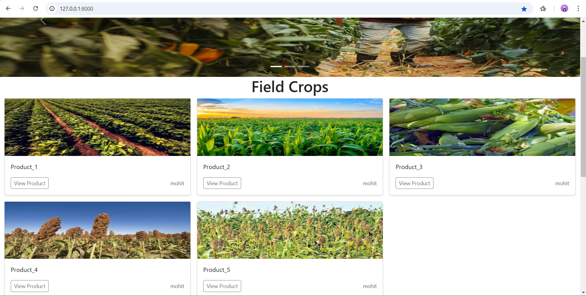
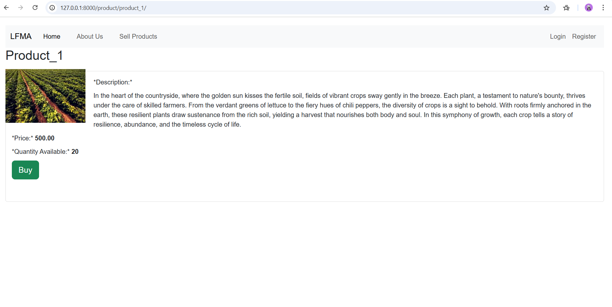

# Overview
The Local Farmers Market App (LFMA) is designed to connect local farmers with customers, enabling them to buy and sell fresh, locally grown produce easily.
This platform provides a digital marketplace that promotes sustainable living and supports small-scale farmers by giving them direct access to buyers.
## Features
- Farmer Registration and Management: Farmers can register, create profiles, and list their products for sale.
- Product Listings: View available products with details like price, quantity, and description.
- Order Management: Customers can place orders, and farmers can manage their sales.
## Screenshots



## Tech Stack
- **Frontend:** HTML, CSS, JavaScript
- **Backend:** Python, Django
- **Database:** SQLite (or any database you used)
- **Others:** Bootstrap for responsive design, Django authentication for secure login

## Installation and Setup

1. Clone the repository:
   ```bash
   git clone https://github.com/Ms2001ucme/LFMA_Project.git
   cd StudyBuddy
   
Create a virtual environment:
>python -m venv env
source env/bin/activate  # For Windows: env\Scripts\activate

Install dependencies:
>pip install -r requirements.txt

Apply migrations:
>python manage.py migrate

Run the development server:
> python manage.py runserver

Open the app in your browser:
> http://127.0.0.1:8000/

## Contributing
Contributions are welcome! Please follow these steps:

1. Fork the repository.
2. Create a new branch:
>git checkout -b feature/your-feature-name

3.Make your changes and commit them:
>git commit -m "Add your message here"

Push to the branch:
>git push origin feature/your-feature-name

Open a pull request and describe your changes.

---
## Acknowledgments
- [Django Documentation](https://docs.djangoproject.com/)
